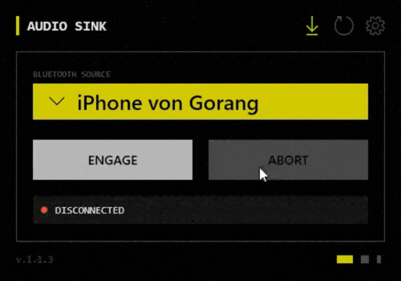

<p align="center">
  
</p>

<h1 align="center">EasyBluetoothAudio</h1>

<p align="center">
  <strong>Hear your phone's music through your PC speakers. One click.</strong><br/>
  Free, open source Bluetooth audio receiver for Windows — no drivers, no configuration.
</p>

<p align="center">
  
  
  
  <a href="https://github.com/GorangN/EasyBluetoothAudio/releases/latest">
    
  </a>
</p>

<p align="center">
  <a href="https://github.com/GorangN/EasyBluetoothAudio/releases/latest">
    
  </a>
</p>

<p align="center">
  
</p>

---

##  Why EasyBluetoothAudio?

Windows doesn't support receiving Bluetooth audio out of the box. EasyBluetoothAudio fills that gap — turning your PC into a Bluetooth speaker in seconds, without modifying drivers or digging through Settings.

| | Benefit |
| :---: | :--- |
|  | **Hear everything from your phone** — music, calls, videos — through your PC speakers or headphones |
|  | **Auto-reconnects** on every startup, so you never have to think about it again |
|  | **Lives in the system tray** — invisible until you need it, no desktop clutter |
|  | **Low latency** — native Windows audio pipeline, no virtual cables or third-party drivers |

---

##  Download & Install

**Requirements:** Windows 10 (version 1903) or Windows 11 &nbsp;·&nbsp; Bluetooth 4.0+ adapter

1. **[Download EasyBluetoothAudio_Setup.exe](https://github.com/GorangN/EasyBluetoothAudio/releases/latest)** from the latest release.
2. Run the installer — the .NET 10 runtime is bundled, nothing else needed.
3. Pair your phone with your PC via Windows Bluetooth settings, then click **Engage**.

> **Windows SmartScreen?** Click **More info &rarr; Run anyway**. The app is open source — you can review every line of code in this repository.

<details>
<summary>Building from Source</summary>

```bash
git clone https://github.com/GorangN/EasyBluetoothAudio.git
cd EasyBluetoothAudio
dotnet restore
dotnet build --configuration Release
```

</details>

---

##  Features

*  **Bluetooth A2DP Sink** — receives high-quality audio from any paired iOS or Android device via the native Windows `AudioPlaybackConnection` API. No virtual drivers required.
*  **Smart Auto-Reconnect** — reconnects automatically on connection loss. 5 s settle time after a full disconnect; instant reconnect when the radio link is intact.
*  **System Tray Workflow** — runs silently in the background. Opens as a flyout from the notification area, just like native Windows panels.
*  **Native Device Picker** — opens the Windows Bluetooth pairing dialog directly from the app. No detour through Settings.
*  **Low-End Hardware Mode** — reduces SBC bitpool (`MaximumBitpool` / `DefaultBitpool` &rarr; 15) to stabilise audio on congested radios. UAC elevation is handled automatically.
*  **Automatic Updates** — checks GitHub Releases for new stable versions and notifies you in-app. Pre-releases are skipped.
*  **Dark & Light Themes** — Cyberpunk High-Contrast Dark (Black / Acid Yellow) and a clean Light Mode, switchable at runtime.

---

##  Settings

All preferences are persisted across sessions:

| Setting | Description |
| :--- | :--- |
| **Auto-Start** | Launch with Windows via a registry startup entry. |
| **Auto-Connect** | Reconnect to the last used device immediately on startup. |
| **Theme** | Switch between Dark (Cyberpunk) and Light mode. |
| **Toast Notifications** | Show or hide Windows toast notifications on connect / disconnect. |
| **Connection Sound** | Play an audible chime when a device connects successfully. |
| **Low-End Hardware Mode** | Reduce SBC bitpool for congested or weak radios. Requires administrator privileges. |

---

##  Technical Stack

<details>
<summary>For developers and contributors</summary>

This project is a reference implementation for modern Windows desktop development with strict Clean Architecture and MVVM.

| Component | Technology | Notes |
| :--- | :--- | :--- |
| **Framework** | .NET 10 | Latest LTS runtime |
| **UI** | WPF | Hardware-accelerated, MVVM strict — zero logic in code-behind |
| **Audio Core** | Windows.Media.Audio (WinRT) | Native `AudioPlaybackConnection` A2DP Sink |
| **Messaging** | CommunityToolkit.Mvvm 8.4.0 | Decoupled Messenger / Mediator |
| **DI** | Microsoft.Extensions.DependencyInjection | Constructor injection throughout |
| **Installer** | Inno Setup + MSIX | Standalone + packaged distribution |
| **Versioning** | MinVer | Automatic semantic versioning from Git tags |

</details>

---

<p align="center">
  <a href="https://github.com/GorangN/EasyBluetoothAudio/releases/latest">
    
  </a><br/>
  <sub>Windows 10 / 11 &nbsp;·&nbsp; Free &nbsp;·&nbsp; Open Source</sub>
</p>
